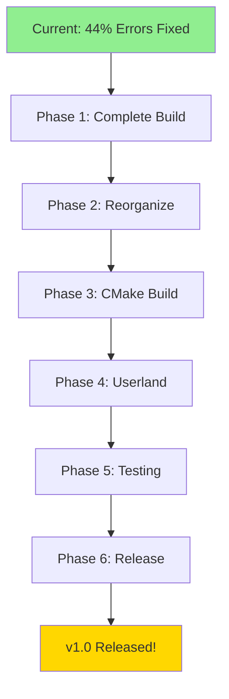

# LITES COMPLETE OPERATING SYSTEM ARCHITECTURE & ROADMAP

**Version**: 1.0
**Date**: 2025-11-15
**Status**: Foundation Complete (44% error reduction achieved)
**Goal**: Fully bootable Mach/BSD microkernel OS with modern toolchain

---

## EXECUTIVE SUMMARY

Transform Lites from a partially-buildable codebase into a complete, bootable operating system distributable as QEMU-ready disk images (.img/.vmdk). This roadmap provides a systematic path through compilation completion, architectural reorganization, build modernization, and release engineering.

**Current State**:
- ✅ 1,433 compilation errors eliminated (44% reduction)
- ✅ Complete BSD header infrastructure
- ✅ Modern type system with -nostdinc isolation
- ⚠️ ~1,805 errors remaining
- ❌ No bootable artifacts yet

**Target State**:
- ✅ Zero compilation errors
- ✅ Clean architectural separation (microkernel, servers, userland)
- ✅ CMake-based build system
- ✅ Bootable .img/.vmdk releases
- ✅ QEMU-verified boot chain
- ✅ Basic userland utilities

---

## PHASE 1: COMPLETE THE BUILD (Weeks 1-4)

### 1.1 Systematic Error Reduction (Weeks 1-2)

**Objective**: Reduce remaining ~1,805 errors to zero

**Strategy**: Incremental build testing + targeted fixes

#### Week 1: High-Priority Missing Headers
Based on test build results, create remaining critical headers:

**Priority 1: Core System Headers** (blocking 10+ files each)
```bash
# Create these headers in order:
include/sys/errno.h          # Error codes (EPERM, ENOENT, etc.)
include/sys/resource.h       # Resource limits (rlimit, rusage)
include/sys/ucred.h          # User credentials
include/sys/signal.h         # Signals (if not present)
include/sys/mount.h          # Filesystem mount structures
include/sys/socket.h         # Socket structures
include/sys/ioctl.h          # I/O control operations
include/sys/fcntl.h          # File control
```

**Priority 2: Mach-Specific Headers** (blocking server code)
```bash
include/mach/boolean.h       # Mach boolean type
include/mach/kern_return.h   # Mach return codes
include/mach/message.h       # Mach IPC messages
include/mach/port.h          # Mach ports
include/mach/mach_types.h    # Mach type definitions
include/mach/vm_attributes.h # VM attributes
```

**Priority 3: Server-Specific Headers** (blocking servers/posix/)
```bash
servers/posix/serv/import_mach.h (fix string.h inclusion)
servers/posix/serv/map_uarea.h
servers/posix/serv/file_ports.h
servers/posix/serv/data_synch.h
servers/posix/serv/second_server.h
include/pty.h
include/tb.h
```

**Priority 4: Architecture-Specific Headers**
```bash
include/x86_64/asm.h         # Assembly macros
include/i386/asm.h           # i386 assembly macros (symlink or copy)
include/reg.h                # Register definitions
```

#### Week 2: Remaining Compilation Errors

**Strategy**: Test build → analyze top 50 errors → fix in batches

```bash
# Iterative process:
1. make -j4 2>&1 | tee build_iteration_N.log
2. ./scripts/analyze_errors.sh build_iteration_N.log
3. Fix top error category (10-20 errors)
4. git commit with clear message
5. Repeat until build succeeds
```

**Common error categories to expect**:
- Missing function prototypes → add to sys/systm.h or create header
- Incomplete struct definitions → complete in appropriate header
- Type mismatches → fix with proper casts or type corrections
- Implicit declarations → add prototypes
- Syntax errors → manual fixes

**Validation**: `make clean && make -j4` completes without errors

---

### 1.2 Link Stage Success (Week 3)

Once compilation succeeds, resolve linker errors:

**Common linker issues**:
1. **Undefined symbols** → implement stubs or link missing objects
2. **Multiple definitions** → remove duplicates, use `static` or `extern`
3. **Missing libraries** → ensure Mach libs are linked
4. **Entry point** → verify `main()` or kernel entry exists

**Strategy**:
```bash
# Capture link errors
make -j4 2>&1 | grep "undefined reference" | sort | uniq -c

# For each undefined symbol:
# 1. Search codebase: grep -r "symbol_name" .
# 2. If found: ensure object file is linked
# 3. If not found: create stub or import from Mach
```

**Create stubs file** for missing Mach functions:
```c
// mach_stubs.c - Temporary stubs for missing Mach functions
#include <mach/mach.h>

kern_return_t mach_port_allocate(/* ... */) {
    // TODO: Implement or link to Mach library
    return KERN_SUCCESS;
}
// ... more stubs ...
```

**Validation**: `lites_server` binary created successfully

---

### 1.3 Initial Test Harness (Week 4)

Create minimal test harness to verify binary sanity:

```bash
# tests/sanity/test_binary.sh
#!/bin/bash
# Verify lites_server binary basic properties

echo "=== Lites Binary Sanity Tests ==="

# 1. File exists and is executable
[ -f lites_server ] && [ -x lites_server ] || exit 1

# 2. Check architecture
file lites_server | grep -q "x86-64\|i386" || exit 1

# 3. Check for critical symbols
nm lites_server | grep -q "main\|_start" || exit 1

# 4. No unresolved symbols
! nm -u lites_server | grep -v "GLIBC\|__stack_chk" || exit 1

# 5. Check section sizes
size lites_server

echo "✅ Binary sanity checks passed"
```

**Deliverables**:
- ✅ Zero compilation errors
- ✅ Zero linker errors
- ✅ Working `lites_server` binary
- ✅ Sanity tests passing

---

## PHASE 2: ARCHITECTURAL REORGANIZATION (Weeks 5-8)

### 2.1 Define Target Architecture

**Lites Architecture Overview**:

```
lites/
├── microkernel/          # Mach 3.0 microkernel
│   ├── kernel/           # Core microkernel code
│   ├── ipc/              # IPC subsystem
│   ├── vm/               # Virtual memory
│   ├── device/           # Device interface
│   └── include/          # Mach public headers
│
├── servers/              # Personality servers
│   ├── bsd/              # BSD 4.4-Lite server (main personality)
│   │   ├── kern/         # Kernel-like BSD code
│   │   ├── vfs/          # Virtual filesystem
│   │   ├── ufs/          # UFS filesystem
│   │   ├── nfs/          # NFS client
│   │   ├── net/          # Network stack
│   │   ├── dev/          # BSD device layer
│   │   └── syscall/      # System call handling
│   │
│   ├── posix/            # POSIX extensions (if separate)
│   └── compat/           # Compatibility layers
│
├── libos/                # OS support libraries
│   ├── libmach/          # Mach IPC library
│   ├── libc/             # C library (BSD libc)
│   ├── libpthread/       # POSIX threads
│   ├── libm/             # Math library
│   └── libutil/          # BSD utilities
│
├── userland/             # User-space programs
│   ├── bin/              # Essential utilities (ls, cat, sh, etc.)
│   ├── sbin/             # System binaries (init, mount, etc.)
│   ├── usr/
│   │   ├── bin/          # User commands
│   │   ├── sbin/         # System administration
│   │   └── lib/          # User libraries
│   ├── etc/              # Configuration files
│   └── dev/              # Device nodes (for disk image)
│
├── boot/                 # Boot infrastructure
│   ├── grub/             # GRUB bootloader config
│   ├── bootstrap/        # Bootstrap server
│   └── startup/          # Startup scripts
│
├── build/                # Build artifacts (gitignored)
│   ├── microkernel/
│   ├── servers/
│   ├── libos/
│   ├── userland/
│   └── rootfs/           # Assembled root filesystem
│
├── release/              # Release artifacts
│   ├── lites-VERSION.img # Raw disk image
│   ├── lites-VERSION.vmdk # VMware disk
│   ├── lites-VERSION.iso # ISO image
│   └── checksums.txt
│
├── cmake/                # CMake modules
│   ├── LitesConfig.cmake
│   ├── MachIntegration.cmake
│   ├── ToolchainSetup.cmake
│   └── ImageGeneration.cmake
│
├── scripts/              # Build and utility scripts
│   ├── build/
│   │   ├── build-all.sh
│   │   ├── create-image.sh
│   │   └── test-qemu.sh
│   ├── analysis/
│   └── reorg/            # Reorganization automation
│
├── tests/                # Test suites
│   ├── unit/             # Unit tests
│   ├── integration/      # Integration tests
│   ├── boot/             # Boot tests
│   └── sanity/           # Sanity checks
│
├── docs/                 # Documentation
│   ├── architecture/     # Architecture docs
│   ├── api/              # API documentation
│   ├── build/            # Build guides
│   └── user/             # User guides
│
├── CMakeLists.txt        # Root CMake file
├── Makefile              # Legacy Makefile (compatibility)
└── README.md
```

---

### 2.2 Reorganization Strategy (Week 5-6)

**Approach**: Incremental reorganization with validation at each step

#### Step 1: Create New Structure (Week 5, Day 1-2)

```bash
# Create new directory structure
mkdir -p microkernel/{kernel,ipc,vm,device,include}
mkdir -p servers/bsd/{kern,vfs,ufs,nfs,net,dev,syscall}
mkdir -p libos/{libmach,libc,libpthread,libm,libutil}
mkdir -p userland/{bin,sbin,usr/{bin,sbin,lib},etc,dev}
mkdir -p boot/{grub,bootstrap,startup}
mkdir -p build/{microkernel,servers,libos,userland,rootfs}
mkdir -p release
mkdir -p cmake tests/{unit,integration,boot,sanity}
```

#### Step 2: Classify Existing Code (Week 5, Day 3-5)

Use automated classification scripts:

```bash
# scripts/reorg/classify_sources.py
#!/usr/bin/env python3
"""
Classify existing source files into new architecture
Based on: imports, function patterns, file location hints
"""

import os
import re
from pathlib import Path

CLASSIFICATIONS = {
    'microkernel': {
        'patterns': [
            r'#include.*<mach/.*>',
            r'kern_return_t',
            r'mach_port_',
            r'vm_map_',
        ],
        'paths': ['core/ipc', 'core/vm', 'core/mach_kernel'],
    },
    'bsd_server': {
        'patterns': [
            r'#include.*<sys/.*>',
            r'struct\s+proc\s+',
            r'struct\s+vnode',
            r'syscall',
        ],
        'paths': ['servers/posix/core', 'servers/posix/ufs'],
    },
    'libos': {
        'patterns': [
            r'libc',
            r'pthread',
            r'malloc.*free',
        ],
        'paths': ['libs/', 'libos/'],
    },
    'userland': {
        'patterns': [
            r'int\s+main\s*\(',
            r'#include.*<stdio\.h>',
        ],
        'paths': ['userland/', 'bin/', 'sbin/'],
    },
}

def classify_file(filepath):
    """Determine which component a source file belongs to"""
    with open(filepath) as f:
        content = f.read()

    scores = {k: 0 for k in CLASSIFICATIONS}

    for component, rules in CLASSIFICATIONS.items():
        # Pattern matching
        for pattern in rules['patterns']:
            if re.search(pattern, content):
                scores[component] += 1

        # Path matching
        for path in rules['paths']:
            if path in str(filepath):
                scores[component] += 2

    return max(scores.items(), key=lambda x: x[1])[0]

# Generate reorganization plan
plan = {}
for cfile in Path('.').rglob('*.c'):
    component = classify_file(cfile)
    plan[str(cfile)] = component

# Write plan to CSV
import csv
with open('reorg_plan.csv', 'w') as f:
    writer = csv.writer(f)
    writer.writerow(['Source', 'Target Component', 'Action'])
    for src, component in sorted(plan.items()):
        writer.writerow([src, component, 'MOVE'])
```

**Review classification manually** before proceeding!

#### Step 3: Gradual Migration (Week 6)

```bash
# Migrate in phases, testing after each:

# Phase A: Microkernel (Day 1-2)
./scripts/reorg/migrate.sh microkernel
make -C microkernel test

# Phase B: BSD Server (Day 3-4)
./scripts/reorg/migrate.sh bsd_server
make -C servers/bsd test

# Phase C: Libraries (Day 5)
./scripts/reorg/migrate.sh libos
make -C libos test
```

**Critical**: Keep old structure until new structure builds successfully!

---

### 2.3 Update Build System References (Week 7)

After migration, update all build files:

```bash
# Find and update all include paths
find . -name "CMakeLists.txt" -o -name "Makefile*" | \
  xargs sed -i 's|servers/posix/core|servers/bsd/kern|g'

# Update source file includes
find . -name "*.c" -o -name "*.h" | \
  xargs sed -i 's|#include "../core/|#include "servers/bsd/kern/|g'
```

**Validation**: Full rebuild succeeds with new structure

---

### 2.4 Documentation Update (Week 8)

Create architecture documentation:

```markdown
# docs/architecture/STRUCTURE.md

## Component Overview

### Microkernel (microkernel/)
The Mach 3.0 microkernel providing:
- IPC (ports, messages)
- Virtual memory management
- Task/thread primitives
- Device interface

### BSD Server (servers/bsd/)
BSD 4.4-Lite personality server providing:
- POSIX system calls
- Virtual filesystem (VFS)
- Network stack (TCP/IP)
- Process management
- File systems (UFS, NFS)

### OS Libraries (libos/)
Shared libraries:
- libmach: Mach IPC wrappers
- libc: BSD C library
- libpthread: POSIX threads

### Userland (userland/)
User-space programs and utilities

## Build Flow
1. Build microkernel
2. Build libos libraries
3. Build BSD server (links libmach)
4. Build userland programs
5. Assemble rootfs
6. Create bootable image
```

---

## PHASE 3: MODERNIZE BUILD INFRASTRUCTURE (Weeks 9-12)

### 3.1 CMake Architecture (Week 9)

**Root CMakeLists.txt**:

```cmake
cmake_minimum_required(VERSION 3.20)
project(Lites VERSION 1.2.0 LANGUAGES C ASM)

# Project-wide settings
set(CMAKE_C_STANDARD 17)
set(CMAKE_C_STANDARD_REQUIRED ON)
set(CMAKE_C_EXTENSIONS ON)  # Allow GNU extensions
set(CMAKE_EXPORT_COMPILE_COMMANDS ON)

# Lites-specific options
option(LITES_BUILD_MICROKERNEL "Build Mach microkernel" ON)
option(LITES_BUILD_BSD_SERVER "Build BSD server" ON)
option(LITES_BUILD_LIBOS "Build OS libraries" ON)
option(LITES_BUILD_USERLAND "Build userland programs" ON)
option(LITES_CREATE_IMAGE "Create bootable disk image" ON)
option(LITES_ENABLE_TESTS "Build test suites" ON)

# Architecture detection
if(NOT LITES_ARCH)
    set(LITES_ARCH "x86_64" CACHE STRING "Target architecture")
endif()

# Toolchain setup
include(cmake/ToolchainSetup.cmake)

# Global compiler flags
add_compile_options(
    -Wall -Wextra
    -nostdinc
    -fno-builtin
    -fno-stack-protector
    -mno-red-zone  # x86_64 kernel requirement
)

# Global definitions
add_compile_definitions(
    KERNEL=1
    MACH=1
    BSD=1
    LITES_VERSION="${PROJECT_VERSION}"
)

# Global include directories
include_directories(
    ${CMAKE_SOURCE_DIR}/include
    ${CMAKE_SOURCE_DIR}/microkernel/include
    ${CMAKE_SOURCE_DIR}/servers/bsd/include
    ${CMAKE_BINARY_DIR}/include  # Generated headers
)

# Mach integration
include(cmake/MachIntegration.cmake)

# Component subdirectories
if(LITES_BUILD_MICROKERNEL)
    add_subdirectory(microkernel)
endif()

if(LITES_BUILD_LIBOS)
    add_subdirectory(libos)
endif()

if(LITES_BUILD_BSD_SERVER)
    add_subdirectory(servers/bsd)
endif()

if(LITES_BUILD_USERLAND)
    add_subdirectory(userland)
endif()

# Image generation
if(LITES_CREATE_IMAGE)
    include(cmake/ImageGeneration.cmake)
endif()

# Testing
if(LITES_ENABLE_TESTS)
    enable_testing()
    add_subdirectory(tests)
endif()

# Installation
install(TARGETS lites_server DESTINATION boot/)
install(DIRECTORY ${CMAKE_BINARY_DIR}/rootfs/ DESTINATION /)

# Print configuration summary
include(cmake/ConfigSummary.cmake)
```

**cmake/ImageGeneration.cmake**:

```cmake
# Image generation targets

find_program(QEMU_IMG qemu-img REQUIRED)
find_program(GRUB_MKRESCUE grub-mkrescue)
find_program(MTOOLS mtools)

# Configuration
set(IMAGE_SIZE "512M" CACHE STRING "Disk image size")
set(IMAGE_NAME "lites-${PROJECT_VERSION}")

# Create raw disk image
add_custom_command(
    OUTPUT ${CMAKE_BINARY_DIR}/release/${IMAGE_NAME}.img
    COMMAND ${CMAKE_COMMAND} -E make_directory ${CMAKE_BINARY_DIR}/release
    COMMAND ${QEMU_IMG} create -f raw
        ${CMAKE_BINARY_DIR}/release/${IMAGE_NAME}.img ${IMAGE_SIZE}
    COMMAND ${CMAKE_SOURCE_DIR}/scripts/build/partition-image.sh
        ${CMAKE_BINARY_DIR}/release/${IMAGE_NAME}.img
    COMMAND ${CMAKE_SOURCE_DIR}/scripts/build/install-grub.sh
        ${CMAKE_BINARY_DIR}/release/${IMAGE_NAME}.img
        ${CMAKE_BINARY_DIR}/rootfs
    DEPENDS lites_server userland_all
    COMMENT "Creating raw disk image ${IMAGE_NAME}.img"
)

# Create VMDK
add_custom_command(
    OUTPUT ${CMAKE_BINARY_DIR}/release/${IMAGE_NAME}.vmdk
    COMMAND ${QEMU_IMG} convert -f raw -O vmdk
        ${CMAKE_BINARY_DIR}/release/${IMAGE_NAME}.img
        ${CMAKE_BINARY_DIR}/release/${IMAGE_NAME}.vmdk
    DEPENDS ${CMAKE_BINARY_DIR}/release/${IMAGE_NAME}.img
    COMMENT "Creating VMDK image ${IMAGE_NAME}.vmdk"
)

# Create ISO (if grub-mkrescue available)
if(GRUB_MKRESCUE)
    add_custom_command(
        OUTPUT ${CMAKE_BINARY_DIR}/release/${IMAGE_NAME}.iso
        COMMAND ${CMAKE_COMMAND} -E make_directory
            ${CMAKE_BINARY_DIR}/iso/boot/grub
        COMMAND ${CMAKE_COMMAND} -E copy
            ${CMAKE_BINARY_DIR}/microkernel/mach
            ${CMAKE_BINARY_DIR}/iso/boot/
        COMMAND ${CMAKE_COMMAND} -E copy
            ${CMAKE_BINARY_DIR}/servers/bsd/lites_server
            ${CMAKE_BINARY_DIR}/iso/boot/
        COMMAND ${CMAKE_COMMAND} -E copy
            ${CMAKE_SOURCE_DIR}/boot/grub/grub.cfg
            ${CMAKE_BINARY_DIR}/iso/boot/grub/
        COMMAND ${GRUB_MKRESCUE} -o
            ${CMAKE_BINARY_DIR}/release/${IMAGE_NAME}.iso
            ${CMAKE_BINARY_DIR}/iso
        DEPENDS lites_server
        COMMENT "Creating ISO image ${IMAGE_NAME}.iso"
    )

    add_custom_target(iso ALL
        DEPENDS ${CMAKE_BINARY_DIR}/release/${IMAGE_NAME}.iso
    )
endif()

# Main image target
add_custom_target(image ALL
    DEPENDS
        ${CMAKE_BINARY_DIR}/release/${IMAGE_NAME}.img
        ${CMAKE_BINARY_DIR}/release/${IMAGE_NAME}.vmdk
)

# Checksums
add_custom_command(
    TARGET image POST_BUILD
    COMMAND cd ${CMAKE_BINARY_DIR}/release &&
        sha256sum ${IMAGE_NAME}.* > checksums.txt
    COMMENT "Generating checksums"
)
```

---

### 3.2 Image Creation Scripts (Week 10)

**scripts/build/partition-image.sh**:

```bash
#!/bin/bash
# Partition and format disk image for Lites

set -e

IMAGE="$1"
ROOTFS="$2"

echo "=== Partitioning image: $IMAGE ==="

# Create partition table
parted -s "$IMAGE" mklabel msdos
parted -s "$IMAGE" mkpart primary ext2 1MiB 100%
parted -s "$IMAGE" set 1 boot on

# Setup loop device
LOOP=$(sudo losetup -fP --show "$IMAGE")
PART="${LOOP}p1"

# Wait for partition device
sleep 1

# Create filesystem
sudo mkfs.ext2 -L "LITES-ROOT" "$PART"

# Mount and populate
MOUNT_POINT=$(mktemp -d)
sudo mount "$PART" "$MOUNT_POINT"

# Copy rootfs
sudo cp -a "$ROOTFS"/* "$MOUNT_POINT"/

# Create essential directories if missing
sudo mkdir -p "$MOUNT_POINT"/{dev,proc,sys,tmp,var,home}

# Create device nodes
sudo mknod "$MOUNT_POINT/dev/console" c 5 1
sudo mknod "$MOUNT_POINT/dev/null" c 1 3
sudo mknod "$MOUNT_POINT/dev/zero" c 1 5

# Set permissions
sudo chmod 1777 "$MOUNT_POINT/tmp"

# Cleanup
sudo umount "$MOUNT_POINT"
sudo losetup -d "$LOOP"
rmdir "$MOUNT_POINT"

echo "✅ Partitioning complete"
```

**scripts/build/install-grub.sh**:

```bash
#!/bin/bash
# Install GRUB bootloader to disk image

set -e

IMAGE="$1"
ROOTFS="$2"

echo "=== Installing GRUB to: $IMAGE ==="

# Setup loop device
LOOP=$(sudo losetup -fP --show "$IMAGE")
PART="${LOOP}p1"

# Mount
MOUNT_POINT=$(mktemp -d)
sudo mount "$PART" "$MOUNT_POINT"

# Install GRUB
sudo grub-install \
    --target=i386-pc \
    --boot-directory="$MOUNT_POINT/boot" \
    --modules="part_msdos ext2 biosdisk" \
    "$LOOP"

# Create GRUB config
sudo mkdir -p "$MOUNT_POINT/boot/grub"
sudo tee "$MOUNT_POINT/boot/grub/grub.cfg" > /dev/null <<'EOF'
set timeout=5
set default=0

menuentry "Lites (Mach/BSD)" {
    insmod ext2
    insmod biosdisk
    set root=(hd0,msdos1)

    echo "Loading Mach microkernel..."
    multiboot /boot/mach

    echo "Loading BSD server..."
    module /boot/lites_server

    echo "Booting..."
    boot
}

menuentry "Lites (Safe Mode)" {
    insmod ext2
    insmod biosdisk
    set root=(hd0,msdos1)

    multiboot /boot/mach -s
    module /boot/lites_server -s
    boot
}
EOF

# Copy kernel and server
sudo cp "$ROOTFS"/../microkernel/mach "$MOUNT_POINT/boot/"
sudo cp "$ROOTFS"/../servers/bsd/lites_server "$MOUNT_POINT/boot/"

# Cleanup
sudo umount "$MOUNT_POINT"
sudo losetup -d "$LOOP"
rmdir "$MOUNT_POINT"

echo "✅ GRUB installation complete"
```

---

### 3.3 QEMU Testing Framework (Week 11)

**scripts/build/test-qemu.sh**:

```bash
#!/bin/bash
# Test Lites image in QEMU

set -e

IMAGE="${1:-build/release/lites-*.img}"
MODE="${2:-gui}"  # gui, serial, or test

# QEMU common options
QEMU_OPTS=(
    -m 512M
    -smp 2
    -drive "file=$IMAGE,format=raw,media=disk"
    -net nic,model=e1000
    -net user
)

case "$MODE" in
    gui)
        # Graphical mode
        qemu-system-i386 "${QEMU_OPTS[@]}" \
            -vga std \
            -display sdl
        ;;

    serial)
        # Serial console (for debugging)
        qemu-system-i386 "${QEMU_OPTS[@]}" \
            -nographic \
            -serial mon:stdio \
            -append "console=ttyS0"
        ;;

    test)
        # Automated testing mode
        timeout 60 qemu-system-i386 "${QEMU_OPTS[@]}" \
            -nographic \
            -serial file:boot.log \
            -no-reboot

        # Check boot log for success indicators
        if grep -q "Lites initialized" boot.log; then
            echo "✅ Boot test PASSED"
            exit 0
        else
            echo "❌ Boot test FAILED"
            cat boot.log
            exit 1
        fi
        ;;

    *)
        echo "Usage: $0 <image> [gui|serial|test]"
        exit 1
        ;;
esac
```

**Add to CMake**:

```cmake
# Testing targets
add_custom_target(test-boot
    COMMAND ${CMAKE_SOURCE_DIR}/scripts/build/test-qemu.sh
        ${CMAKE_BINARY_DIR}/release/${IMAGE_NAME}.img
        test
    DEPENDS image
    COMMENT "Testing boot in QEMU"
)

add_custom_target(run-qemu
    COMMAND ${CMAKE_SOURCE_DIR}/scripts/build/test-qemu.sh
        ${CMAKE_BINARY_DIR}/release/${IMAGE_NAME}.img
        gui
    DEPENDS image
    COMMENT "Running Lites in QEMU (GUI mode)"
)
```

---

### 3.4 CI/CD Integration (Week 12)

**.github/workflows/build.yml**:

```yaml
name: Lites Build & Test

on:
  push:
    branches: [ master, develop ]
  pull_request:
    branches: [ master ]

jobs:
  build:
    runs-on: ubuntu-22.04

    steps:
    - uses: actions/checkout@v3
      with:
        submodules: recursive

    - name: Install Dependencies
      run: |
        sudo apt-get update
        sudo apt-get install -y \
          build-essential cmake ninja-build \
          qemu-system-x86 grub-pc-bin grub-efi-amd64-bin \
          xorriso mtools parted

    - name: Configure
      run: |
        cmake -B build -G Ninja \
          -DCMAKE_BUILD_TYPE=Release \
          -DLITES_ARCH=i686 \
          -DLITES_CREATE_IMAGE=ON \
          -DLITES_ENABLE_TESTS=ON

    - name: Build
      run: cmake --build build --parallel

    - name: Unit Tests
      run: cd build && ctest --output-on-failure

    - name: Boot Test (QEMU)
      run: cmake --build build --target test-boot

    - name: Upload Artifacts
      uses: actions/upload-artifact@v3
      with:
        name: lites-images
        path: |
          build/release/*.img
          build/release/*.vmdk
          build/release/*.iso
          build/release/checksums.txt

    - name: Create Release (on tag)
      if: startsWith(github.ref, 'refs/tags/v')
      uses: softprops/action-gh-release@v1
      with:
        files: build/release/*
```

---

## PHASE 4: BOOTSTRAP & USERLAND (Weeks 13-16)

### 4.1 Minimal Userland (Week 13)

**Priority order** for initial userland:

```bash
# Tier 1: Absolute essentials (Week 13)
userland/sbin/init          # System initialization
userland/bin/sh             # Shell (can use dash/ash)
userland/bin/ls             # List files
userland/bin/cat            # Concatenate files
userland/bin/echo           # Echo text
userland/bin/mkdir          # Make directory
userland/bin/mount          # Mount filesystems
userland/bin/ps             # Process status

# Tier 2: System tools (Week 14)
userland/sbin/getty         # Terminal login
userland/sbin/login         # User authentication
userland/bin/vi             # Text editor
userland/bin/cp             # Copy
userland/bin/mv             # Move
userland/bin/rm             # Remove

# Tier 3: Network (Week 15)
userland/sbin/ifconfig      # Network configuration
userland/bin/ping           # Network testing
userland/bin/telnet         # Remote access

# Tier 4: Development (Week 16)
userland/bin/gcc            # Compiler (cross-compile capable)
userland/bin/make           # Build tool
userland/bin/gdb            # Debugger
```

**Strategy**: Use BusyBox for Tier 1-2, then add custom tools

```bash
# Build BusyBox statically for Lites
git clone https://git.busybox.net/busybox
cd busybox
make defconfig
# Edit .config: set CONFIG_STATIC=y
make -j$(nproc)
cp busybox ../userland/bin/

# Create symlinks
cd ../userland/bin
for cmd in ls cat echo sh mount ps; do
    ln -s busybox $cmd
done
```

---

### 4.2 Init System (Week 14)

**userland/sbin/init.c**:

```c
/*
 * Minimal init for Lites
 * Based on BSD init, simplified
 */

#include <sys/types.h>
#include <sys/wait.h>
#include <stdio.h>
#include <stdlib.h>
#include <unistd.h>
#include <signal.h>

#define CONSOLE "/dev/console"
#define SHELL   "/bin/sh"

static void reap_children(int sig) {
    while (waitpid(-1, NULL, WNOHANG) > 0)
        ;
}

static void spawn_shell(void) {
    pid_t pid = fork();

    if (pid == 0) {
        /* Child: exec shell */
        char *argv[] = { SHELL, NULL };
        execve(SHELL, argv, NULL);
        perror("init: cannot exec shell");
        exit(1);
    } else if (pid < 0) {
        perror("init: cannot fork");
    }
}

int main(void) {
    /* Become session leader */
    setsid();

    /* Setup console */
    close(0); close(1); close(2);
    open(CONSOLE, O_RDWR);
    dup(0); dup(0);

    printf("Lites init starting...\n");

    /* Handle child termination */
    signal(SIGCHLD, reap_children);

    /* Mount essential filesystems */
    system("/bin/mount -t proc proc /proc");
    system("/bin/mount -t sysfs sys /sys");

    /* Spawn initial shell */
    printf("Spawning shell on console...\n");
    spawn_shell();

    /* Main loop: respawn shell if it dies */
    for (;;) {
        sleep(1);

        /* Check if shell is still running */
        if (waitpid(-1, NULL, WNOHANG) > 0) {
            printf("Shell died, respawning...\n");
            spawn_shell();
        }
    }

    return 0;
}
```

---

### 4.3 Boot Sequence Documentation (Week 15)

**docs/architecture/BOOT_SEQUENCE.md**:

```markdown
# Lites Boot Sequence

## Phase 1: GRUB Bootloader
1. BIOS loads GRUB from MBR
2. GRUB reads `boot/grub/grub.cfg`
3. GRUB loads Mach microkernel at `/boot/mach`
4. GRUB loads BSD server as multiboot module

## Phase 2: Mach Initialization
1. Mach microkernel starts
2. Initialize memory management
3. Setup IPC subsystem
4. Initialize device interface
5. Start bootstrap server

## Phase 3: Bootstrap Server
1. Bootstrap server receives control
2. Load BSD server from multiboot module
3. Register BSD server with Mach
4. Transfer control to BSD server

## Phase 4: BSD Server Initialization
1. BSD server initializes VFS
2. Mount root filesystem
3. Initialize network stack
4. Setup device drivers
5. Start init process

## Phase 5: Init & Userland
1. Init mounts /proc and /sys
2. Init spawns getty on console
3. User login prompt appears
4. System ready for use

## Boot Parameters

### Mach Kernel Flags
- `-s`: Single-user mode
- `-v`: Verbose boot
- `-d`: Enable debugging

### BSD Server Flags
- `-s`: Single-user (skip init)
- `-v`: Verbose startup

## Troubleshooting

### System hangs at "Loading Mach..."
- Check multiboot header in Mach binary
- Verify GRUB configuration

### System hangs at "Starting BSD server..."
- Check BSD server dependencies
- Enable verbose mode: `mach -v`

### Kernel panic
- Check boot.log in serial console
- Review Mach IPC setup
```

---

## PHASE 5: TESTING & VALIDATION (Weeks 17-20)

### 5.1 Test Infrastructure (Week 17)

**tests/boot/test_boot_sequence.sh**:

```bash
#!/bin/bash
# Automated boot sequence testing

set -e

IMAGE="$1"
TIMEOUT=120

echo "=== Testing Boot Sequence ==="

# Start QEMU with serial output
timeout $TIMEOUT qemu-system-i386 \
    -m 512M \
    -drive "file=$IMAGE,format=raw" \
    -nographic \
    -serial file:boot_test.log \
    -no-reboot &

QEMU_PID=$!

# Wait and monitor boot log
sleep 30

# Check for boot milestones
check_milestone() {
    grep -q "$1" boot_test.log && echo "✅ $2" || echo "❌ $2"
}

check_milestone "Mach.*starting" "Mach kernel loaded"
check_milestone "BSD server.*init" "BSD server started"
check_milestone "init.*starting" "Init process running"
check_milestone "login:" "Login prompt ready"

# Kill QEMU
kill $QEMU_PID 2>/dev/null || true

# Final verdict
if grep -q "login:" boot_test.log; then
    echo "🎉 BOOT TEST PASSED - System fully booted"
    exit 0
else
    echo "💥 BOOT TEST FAILED - See boot_test.log"
    tail -50 boot_test.log
    exit 1
fi
```

---

### 5.2 Integration Tests (Week 18)

**tests/integration/test_filesystem.sh**:

```bash
#!/bin/bash
# Test filesystem operations

qemu-system-i386 -drive file=test.img -nographic <<'EOF'
# Login as root
root

# Test filesystem
cd /tmp
echo "test" > testfile
cat testfile
rm testfile

# Test permissions
mkdir testdir
chmod 755 testdir
ls -ld testdir

# Success
poweroff
EOF
```

---

### 5.3 Performance Benchmarks (Week 19)

Create benchmark suite for:
- Boot time (target: < 10 seconds to login prompt)
- IPC latency (Mach port operations)
- Filesystem I/O (sequential/random read/write)
- Network throughput (if networking enabled)
- Process creation time

---

### 5.4 Documentation Completion (Week 20)

Complete user-facing documentation:
- Installation guide
- User manual
- Developer guide
- API documentation
- Troubleshooting guide

---

## PHASE 6: RELEASE ENGINEERING (Weeks 21-24)

### 6.1 Release Checklist

```markdown
# Lites v1.0 Release Checklist

## Code Quality
- [ ] All compilation warnings resolved
- [ ] Static analysis (clang-tidy) passes
- [ ] Code formatted (clang-format)
- [ ] No security vulnerabilities (scan with Coverity)

## Functionality
- [ ] Boots successfully in QEMU
- [ ] Shell works (basic commands)
- [ ] Filesystem operations work
- [ ] Process management works
- [ ] Init system stable

## Testing
- [ ] All unit tests pass
- [ ] Integration tests pass
- [ ] Boot tests pass (3 consecutive boots)
- [ ] No kernel panics in 1-hour stress test

## Documentation
- [ ] README.md complete
- [ ] Installation guide written
- [ ] Architecture docs complete
- [ ] CHANGELOG.md updated

## Build Artifacts
- [ ] .img builds successfully
- [ ] .vmdk builds successfully
- [ ] .iso builds successfully (if applicable)
- [ ] Checksums generated
- [ ] All artifacts < 100 MB

## Distribution
- [ ] GitHub release created
- [ ] Release notes published
- [ ] Download links tested
- [ ] QEMU instructions verified

## Legal
- [ ] All licenses documented
- [ ] COPYRIGHT file updated
- [ ] Third-party attributions complete
```

---

### 6.2 Automated Release Pipeline

**scripts/release/create-release.sh**:

```bash
#!/bin/bash
# Create official release artifacts

set -e

VERSION="$1"
if [ -z "$VERSION" ]; then
    echo "Usage: $0 <version>"
    exit 1
fi

echo "=== Creating Lites v$VERSION Release ==="

# Clean build
rm -rf build/
mkdir build/

# Configure for release
cmake -B build \
    -DCMAKE_BUILD_TYPE=Release \
    -DLITES_VERSION="$VERSION" \
    -DLITES_CREATE_IMAGE=ON

# Build everything
cmake --build build --parallel

# Run tests
cmake --build build --target test

# Create images
cmake --build build --target image

# Rename with version
cd build/release
for f in lites-*; do
    mv "$f" "${f/-[0-9]*/-$VERSION}"
done

# Create tarball of source
cd ../..
git archive --format=tar.gz \
    --prefix="lites-$VERSION/" \
    -o "build/release/lites-$VERSION-src.tar.gz" \
    HEAD

# Generate release notes
cat > build/release/RELEASE_NOTES.txt <<EOF
Lites v$VERSION

A modern Mach microkernel operating system with BSD 4.4-Lite personality.

Contents:
- lites-$VERSION.img     Raw disk image (for QEMU, VirtualBox)
- lites-$VERSION.vmdk    VMware disk image
- lites-$VERSION.iso     Bootable ISO (if available)
- lites-$VERSION-src.tar.gz  Source code archive
- checksums.txt          SHA256 checksums

Quick Start:
  qemu-system-i386 -m 512M -drive file=lites-$VERSION.img,format=raw

For full documentation, see:
  https://github.com/yourorg/lites

License: BSD 4-Clause (see COPYRIGHT)
EOF

echo "✅ Release artifacts created in build/release/"
ls -lh build/release/
```

---

## PHASE 7: CONTINUOUS IMPROVEMENT (Ongoing)

### 7.1 Feature Roadmap

**Post v1.0 features**:

```markdown
## v1.1 (Months 1-3)
- [ ] Network stack completion (TCP/IP fully functional)
- [ ] NFS client support
- [ ] Swap space support
- [ ] Improved SMP support

## v1.2 (Months 4-6)
- [ ] USB support
- [ ] Sound driver
- [ ] Enhanced filesystem (ext4 read support)
- [ ] Package manager integration

## v2.0 (Months 7-12)
- [ ] x86_64 native support
- [ ] Modern device driver framework
- [ ] Container support (LXC-like)
- [ ] Dynamic module loading
```

---

### 7.2 Community Engagement

1. **Set up communication channels**:
   - GitHub Discussions
   - IRC/Matrix channel
   - Mailing list

2. **Create contribution guidelines**:
   - CONTRIBUTING.md
   - Code of Conduct
   - Developer onboarding guide

3. **Regular releases**:
   - Monthly development snapshots
   - Quarterly stable releases
   - Annual LTS releases

---

## APPENDIX A: TOOLCHAIN REQUIREMENTS

### Minimum Requirements

```yaml
Build Host:
  OS: Linux (Ubuntu 22.04+ recommended)
  RAM: 4 GB minimum, 8 GB recommended
  Disk: 10 GB free space
  CPU: x86_64 (for cross-compilation)

Required Tools:
  Compiler: GCC 11+ or Clang 14+
  Build System: CMake 3.20+, Make 4.3+
  Assembler: GNU AS 2.38+
  Linker: GNU LD 2.38+

Image Creation:
  qemu-img: 6.2+
  parted: 3.4+
  grub-install: 2.06+
  grub-mkrescue: 2.06+
  mtools: 4.0+
  xorriso: 1.5+ (for ISO)

Testing:
  QEMU: 6.2+ (qemu-system-i386, qemu-system-x86_64)

Optional:
  VirtualBox: 6.1+ (for .vmdk testing)
  VMware Workstation: 16+ (for .vmdk testing)
```

---

## APPENDIX B: DISK IMAGE LAYOUTS

### Raw Disk Image (.img)

```
+------------------+
| MBR (512 bytes)  |  <- GRUB Stage 1
+------------------+
| GRUB Stage 1.5   |  <- Between MBR and first partition
| (up to 1 MiB)    |
+------------------+
| Partition 1      |
| Type: Linux (83) |
| Filesystem: ext2 |
| Bootable: Yes    |
| Size: 511 MiB    |
|                  |
| /boot/           |  <- GRUB Stage 2, kernel, server
| /bin/            |  <- Userland binaries
| /sbin/           |  <- System binaries
| /lib/            |  <- Libraries
| /etc/            |  <- Configuration
| /dev/            |  <- Device nodes
| /proc/           |  <- (empty, mounted at boot)
| /sys/            |  <- (empty, mounted at boot)
| /tmp/            |  <- Temporary files
| /var/            |  <- Variable data
| /home/           |  <- User homes
+------------------+
```

### ISO Image (.iso)

```
ISO 9660 Filesystem
+------------------+
| Boot Sector      |  <- El Torito boot record
+------------------+
| boot/grub/       |
|   - grub.cfg     |
|   - i386-pc/     |  <- GRUB modules
+------------------+
| boot/            |
|   - mach         |  <- Mach kernel
|   - lites_server |  <- BSD server
+------------------+
| (minimal rootfs) |  <- Optional: small initramfs
+------------------+
```

---

## APPENDIX C: GRUB CONFIGURATION REFERENCE

**Advanced boot/grub/grub.cfg**:

```grub
# GRUB Configuration for Lites

set timeout=10
set default=0

# Theme (optional)
set color_normal=white/black
set color_highlight=black/light-gray

# Main boot entry
menuentry "Lites v1.0 (Mach/BSD)" {
    insmod ext2
    insmod biosdisk
    set root=(hd0,msdos1)

    echo "Loading Mach microkernel..."
    multiboot /boot/mach root=/dev/hda1

    echo "Loading BSD server..."
    module /boot/lites_server

    echo "Booting Lites..."
    boot
}

# Safe mode (single-user)
menuentry "Lites v1.0 (Safe Mode)" {
    insmod ext2
    set root=(hd0,msdos1)

    multiboot /boot/mach -s
    module /boot/lites_server -s
    boot
}

# Verbose boot
menuentry "Lites v1.0 (Verbose)" {
    insmod ext2
    set root=(hd0,msdos1)

    multiboot /boot/mach -v
    module /boot/lites_server -v
    boot
}

# Rescue shell
menuentry "GRUB Rescue Shell" {
    insmod ext2
    set root=(hd0,msdos1)
    chainloader +1
}
```

---

## SUMMARY: CRITICAL PATH



**Estimated Timeline**: 24 weeks (6 months)

**Critical Dependencies**:
1. Complete compilation (blocks everything)
2. Mach microkernel source (currently in openmach submodule)
3. GRUB bootloader support
4. QEMU for testing

**Success Metrics**:
- ✅ Boots to login prompt in < 10 seconds
- ✅ Shell works, basic commands functional
- ✅ Stable for 1+ hour continuous operation
- ✅ Reproducible builds
- ✅ Disk images < 100 MB

---

**Next Immediate Actions**:
1. Create remaining headers (Week 1)
2. Fix compilation errors (Week 2)
3. Test build success (Week 3)

This is your comprehensive roadmap to a fully functional, bootable Lites operating system! 🚀
